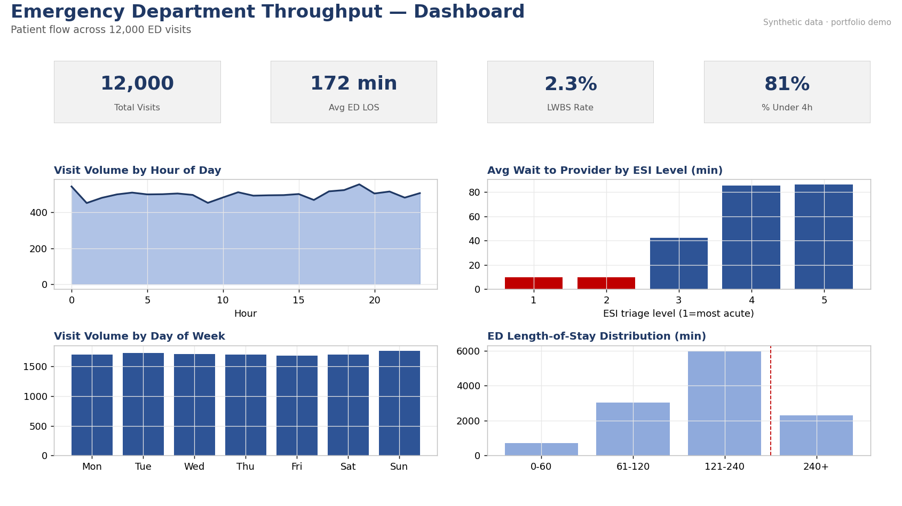

# Emergency Department Throughput Analysis

Analyzing patient flow through an emergency department — wait times, length of stay, left-without-being-seen (LWBS), and inpatient boarding — the operational metrics an ED manager watches daily.

## Business question
Where are the bottlenecks in ED flow, and when (which hours, shifts, and acuity levels) do patients wait too long or walk out before being seen?

## Dataset (synthetic)
`data/ed_visits.csv` — 12,000 ED visits with arrival time, mode, ESI triage level (1–5), chief complaint, and timestamped flow metrics: door-to-triage, triage-to-provider, total ED LOS, disposition, LWBS flag, and inpatient boarding time.

Synthetic data generated with NumPy (`../_generate_data.py`, seed 42). Wait times and LOS scale realistically with acuity and time-of-day load.

## Key findings
- **Average ED length of stay: ~172 minutes**, with **~81% of visits under the 4-hour target**.
- **LWBS rate: ~2.3%**, concentrated in lower-acuity visits during peak evening hours — patients lost to long waits.
- **Wait to provider rises sharply with lower acuity:** ESI-3 patients wait ~42 min on average while ESI 1–2 are seen within minutes, as intended.
- **Boarding** (admitted patients waiting for an inpatient bed) is a major hidden driver of crowding — quantified separately so it isn't blamed on the ED.
- Volume follows a clear **hour-of-day and day-of-week curve**, a direct staffing signal.

## What's in this repo
- `sql/schema.sql` — table definition and load commands.
- `sql/analysis.sql` — 8 queries: headline KPIs, wait by ESI (with median/p90 percentiles), volume by hour and day, LWBS by shift, boarding burden, 4-hour LOS compliance, top chief complaints.
- `excel/ed_throughput_analysis.xlsx` — live workbook: KPI dashboard + by-ESI, by-hour (line chart), and by-day breakdowns (formula-driven, zero errors).
- `powerbi/powerbi_spec.md` — Power BI build guide: model, DAX, and a 3-page operations report.

## How to use
1. **SQL (DuckDB — fastest):** from this project folder, run `duckdb`, then `.read sql/load_duckdb.sql` followed by `.read sql/analysis.sql`. The loader uses relative paths, so no editing needed. (For PostgreSQL, use `schema.sql`; `PERCENTILE_CONT` works in both.)
2. **Excel:** open the workbook; Dashboard recalculates from the `ED_Visits` tab.
3. **Power BI:** follow `powerbi_spec.md`.

## Skills demonstrated
Operational KPI design · percentile/distribution analysis in SQL · time-series and shift analysis · Excel charting · BI dashboard design · ED operations domain framing.
