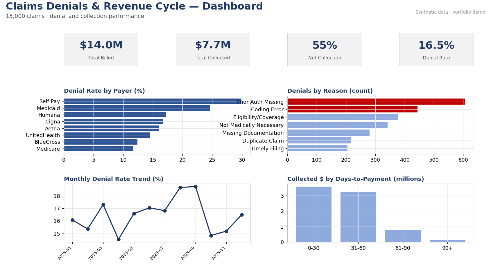

# Claims Denials & Revenue Cycle Analysis

Analyzing medical claims to quantify denials, collection performance, and recovery opportunities — the heart of healthcare revenue-cycle management (RCM).

## Business question
How much revenue is lost to denials, which payers and denial reasons drive it, and where should the RCM team focus to recover the most money?

## Dataset (synthetic)
`data/claims.csv` — 15,000 claims with payer, department, CPT code, billed and paid amounts, service/submit/paid dates, denial flag, denial reason, claim status (Paid / Denied / Appealed-Paid / Appealed-Denied / Written Off), and days-to-payment.

Synthetic data generated with NumPy (`../_generate_data.py`, seed 42). Denial probability varies realistically by payer and department.

## Key findings
- **Denial rate: ~16.5%** of claims — within the typical 10–20% industry range.
- **Net collection rate: ~55%** of billed charges, leaving a **~$6.3M revenue gap** across the dataset.
- **Top denial reasons** are *preventable* front-end errors: **Prior Auth Missing** and **Coding Error** lead the Pareto — the highest-ROI fixes.
- Denial rates differ by **payer** (Medicaid/Self-Pay highest, Medicare lowest) and by **department** (Radiology and Emergency elevated).
- Appeal outcomes quantify how much denied revenue is actually **recoverable**, and aging buckets show how fast paid claims convert to cash.

## What's in this repo
- `sql/schema.sql` — table definition and load commands.
- `sql/analysis.sql` — 8 queries: headline RCM KPIs, denial rate by payer, denial-reason Pareto, denials by department, appeal outcomes, monthly trend, AR aging buckets, high-dollar recovery worklist.
- `excel/claims_denials_analysis.xlsx` — live workbook: KPI dashboard + by-payer, by-denial-reason (Pareto), and by-department breakdowns (formula-driven, zero errors).
- `powerbi/powerbi_spec.md` — Power BI build guide: model, DAX, and a 3-page revenue-cycle report.

## How to use
1. **SQL (DuckDB — fastest):** from this project folder, run `duckdb`, then `.read sql/load_duckdb.sql` followed by `.read sql/analysis.sql`. The loader uses relative paths, so no editing needed. (For PostgreSQL, use `schema.sql`; the only dialect difference is the monthly-trend query, noted inline.)
2. **Excel:** open the workbook; Dashboard recalculates from the `Claims` tab.
3. **Power BI:** follow `powerbi_spec.md`.

## Skills demonstrated
Revenue-cycle KPI design · Pareto / root-cause analysis · conditional aggregation and window functions in SQL · financial Excel modeling · BI dashboard design · RCM domain framing.
