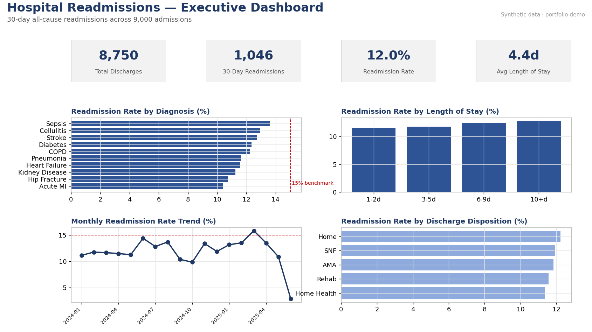

# Healthcare Data Analyst Portfolio

## About the author

Rusa Maja Pedigo — healthcare operations and data.

I spent three years in hospital referrals, prior authorization, and denials at a US health system, most recently as a team lead, and served as my department's Epic super user. The claims denials project here is the work I did every day. The readmissions and ED throughput projects are the reports I wished I'd had while doing it.

Power BI · SQL · Advanced Excel · Python
Belgrade, Serbia and Hartford, Connecticut
majapedigo@gmail.com

Three end-to-end healthcare analytics projects, each built the way a working data analyst would: a business question, a clean data model, analytical SQL, a live Excel workbook, and a Power BI dashboard spec. All datasets are **synthetic** (NumPy, seed 42) — realistic but containing no real patient data.



> Each project README opens with a dashboard like the one above (ED Throughput and Claims have their own).

| # | Project | Domain | Headline insight |
|---|---------|--------|------------------|
| 1 | [Hospital Readmissions](01_hospital_readmissions) | Clinical quality | ~12% 30-day readmission rate; Sepsis, Cellulitis & Stroke run highest |
| 2 | [ED Throughput](02_ed_throughput) | Operations | ~172-min avg ED stay; ~81% under the 4-hour target; LWBS spikes in peak evenings |
| 3 | [Claims Denials](03_claims_denials) | Revenue cycle | ~16.5% denial rate, ~55% net collection, ~$6.3M gap; Prior-Auth & Coding lead |

## Each project contains
- `data/` — synthetic CSV datasets
- `sql/` — `schema.sql` (Postgres), `load_duckdb.sql` (one-command DuckDB load), and `analysis.sql` (8 analytical queries)
- `images/` — the rendered dashboard PNG shown in the project README
- `excel/` — a live `.xlsx` workbook: KPI dashboard + breakdown tabs with charts, all formula-driven (SUMIFS/COUNTIFS/AVERAGEIFS), recalculated to **zero formula errors**
- `powerbi/` — a build spec: data model, DAX measures, and a 3-page report layout
- `README.md` — business question, dataset, findings, and how to run

## Tech stack
**SQL** (PostgreSQL syntax — window functions, conditional aggregation, percentiles) · **Excel** (formula modeling, pivots-via-formulas, charts) · **Power BI** (data modeling, DAX, dashboard design).

## Regenerating the data
```bash
pip install pandas numpy openpyxl matplotlib
python _generate_data.py     # writes all CSVs
python _build_excel.py       # builds all three workbooks
python _build_dashboards.py  # renders the dashboard PNGs
```

## Data disclaimer
All data in this repository is **synthetic** — generated programmatically with NumPy (`_generate_data.py`, fixed seed for reproducibility). It contains no real patients and no protected health information (PHI). Synthetic data is used deliberately: it keeps the project fully shareable while respecting the HIPAA constraints that govern real healthcare data. Distributions (readmission rates, ED wait times, denial rates) were tuned to fall within realistic industry ranges so the analysis remains meaningful.


## License
MIT — see [LICENSE](LICENSE).
